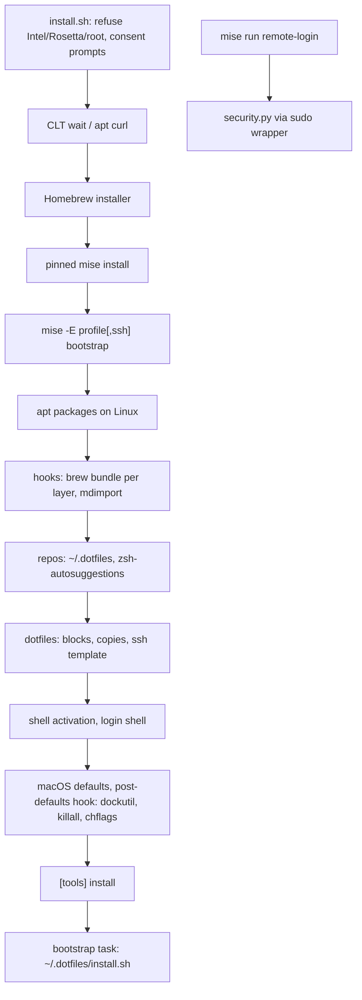

# Provisioning review: why the custom code exists and how to remove most of it

> **Status: implemented on branch `mise-bootstrap-migration` (commits
> `8476146`..`66f7cb6`, 2026-10-08); awaiting the owner's Mac test.**
> Sections 1-8 describe the repository at commit
> `11f544bfeb16d970068a96cfd7e214f1d2f9b815`, before the migration, and
> are kept as the record of why. Section 13 records the outcome and the
> owner's Mac test checklist. `AGENTS.md` on the branch describes the
> code as it is now. Two research agents produced independent findings:
> Astra (outside-in landscape survey) and Fable (inside-out code audit).
> A read-only scout produced a per-file fact sheet. The raw findings are in
> `docs/research/`. Line counts in sections 1-8 come from `wc -l` on the
> pre-migration commit; post-migration estimates there are labelled as
> such, and section 13 gives the measured result.

## 1. Summary

The owner asked three questions. Short answers:

**Why does ~4,900 lines of custom Python and shell exist?**
Because the repository replaced Ansible in a single cutover and moved every
Ansible responsibility into Python standard-library helpers. `AGENTS.md:3-7`
records that decision: "Mise owns runtimes and the command interface.
Homebrew owns native formulae and casks. Python standard-library helpers own
configuration and privileged operations." The custom code is split almost
evenly: 2,353 lines of production code (Python 1,925, shell 428) and 2,214
lines of checks (Python 1,678, Bats 536). About 830 production lines
implement the Remote Login safety contract (`AGENTS.md:229-314`), which no
framework provides. The rest re-implements configuration layering, package
installation, file editing, macOS defaults, Dock and Git checkout logic that
mise now provides natively.

**Is mise the wrong tool?**
No. The repository uses one part of mise (tools and tasks) and ignores the
other part (`mise bootstrap`). The pinned release, `mise 2026.10.3`, ships
`mise bootstrap` with: system packages, privileged files and directories,
Git repositories with origin and clean-worktree checks, dotfile block edits
and templates, shell activation, macOS `defaults`, LaunchAgents, login shell,
versioned tools, ordered hooks, a `bootstrap` task, `--dry-run`, `plan`,
`status`, `--only`, `--skip` and `--adopt`. These were verified with
`mise bootstrap --help` on this host, not only from documentation
(section 4). The earlier mise cutover stopped at Homebrew because mise's
*native bottle installer* failed on clean Ubuntu (`ARCHITECTURE-REPORT.md:9-12`).
That failure is a reason not to use one package backend. It is not a reason
to avoid `mise bootstrap` as the engine, because bootstrap hooks can call
`brew bundle` unchanged.

**Can the custom code be removed?**
Most of it. Both researchers reached the same end state independently:

- `mise bootstrap` becomes the provisioning engine.
- Homebrew Bundle stays as the executor for native packages, casks and
  App Store apps. The existing `packages/**/Brewfile.*` files do not change.
- `scripts/devsetup/security.py` (Remote Login) stays as the one genuinely
  custom component, with its checks.
- `scripts/update.sh`, `scripts/with-sudo-askpass.sh` (for Remote Login
  only) and a ~70-line `install.sh` stay.
- `host.py`, `software.py`, most of `config.py` and `cli.py`,
  `check-platforms.py` and `check-software.py` go.

Estimated result after migration: about 1,100 production lines and about
1,250 check lines, of which roughly 90% is the Remote Login contract the
owner wrote on purpose. Alternatives that add a second engine (nix-darwin,
chezmoi, Ansible) were rejected by both researchers (section 5).

## 2. Why each part of the code exists

Classification: **A** replaceable by mise or Homebrew with no loss;
**B** replaceable with a named loss; **C** genuinely custom, keep;
**D** dead weight, delete.

| # | Responsibility | Where (lines) | Contract that justifies it | Class | Replacement or reason to keep |
| --- | --- | --- | --- | --- | --- |
| 1 | Profile, OS, architecture, root validation | `install.sh:73-110`, `config.py` (~80) | `AGENTS.md:40,61` | B | mise `os` selectors and `-E <profile>` select; a ~15-line shell check keeps the Intel/Rosetta/root refusal |
| 2 | Consent prompts (1Password SSH, dotfiles) | `install.sh:112-146` (35) | `AGENTS.md:101,114-119` | C | mise has one `--yes` for the whole run; per-feature consent is a product decision |
| 3 | Xcode CLT and apt prerequisites | `bootstrap-macos.sh`, `bootstrap-ubuntu.sh` (16) | `AGENTS.md:41-43` | B | apt list moves to `[bootstrap.packages]`; the CLT wait stays |
| 4 | Homebrew bootstrap | `bootstrap-homebrew.sh` (25) | `AGENTS.md:5` | C | Stays while Homebrew is the executor |
| 5 | mise download with SHA-256 pin and `~/.local/bin/mise` link | `bootstrap-mise.sh:1-57` | `AGENTS.md:42,241` | B | Optional: `mise.run` with `MISE_VERSION`, or packslip (Sigstore). Loss: the reviewed SHA-256 |
| 6 | Locked helper Python | `bootstrap-mise.sh:58-59`, `mise.lock`, `mise.toml:12-14` | `AGENTS.md:21` | D after migration | Only `security.py` needs Python; keep it until then |
| 7 | TOML layering: `defaults.toml`, `--config`, `[mac]`/`[linux]`, `[steps]` by key | `config.py` (252), `defaults.toml` (132) | `AGENTS.md:53-70` | A | mise config hierarchy: `mise.toml`, `mise.macos.toml`, `mise.linux.toml`, `mise.<profile>.toml`, `mise.local.toml` |
| 8 | Step policy, `--skip`, fixed order, non-fatal GUI issue list | `cli.py` (207), `install.sh:21-72` | `AGENTS.md:62-70,84-86,195-205` | B | `mise bootstrap --only/--skip` uses mise part names, not repo step names. Loss: the GUI/App Store "continue and list issues" behaviour unless the hook tolerates failure |
| 9 | Brewfile concatenation per layer, `brew bundle --file=-` | `software.py` (~40) | `AGENTS.md:166-172` | A | `brew bundle` accepts one `--file`; run it once per layer file from a hook. Concatenation was an optimisation |
| 10 | Removal of replaced packages (`tldr`, `claude-code@latest`) | `software.py` (~15) | `AGENTS.md:202-205` | D | Two `brew uninstall` lines in a hook, or drop after the next fresh install |
| 11 | `tools.*.toml` layer merge and `conf.d` fragment writer with symlink guard | `software.py` (~120) | `AGENTS.md:134-139,172-176` | A | mise merges `[tools]` across files; `os = [...]` selectors and `-E` replace the four-directory layout; `mise bootstrap --adopt` or a `[dotfiles]` symlink replaces the generated fragment |
| 12 | GUI and App Store bundles, `mdimport` | `software.py` (~30) | `AGENTS.md:196-201` | A | Two hook lines on macOS |
| 13 | Node, pnpm, `PNPM_HOME` block, `pnpm_global_packages` | `software.py` (~25) | `AGENTS.md:207-216` | A / D | `[tools]` plus `[env] _.path`; `pnpm_global_packages` is empty (`defaults.toml:20`) and `npm:` tools already give global CLIs |
| 14 | fzf shell integration | `host.py` (~10) | `AGENTS.md:141-142` | A | Hook plus a `[dotfiles]` block |
| 15 | Login shell, Oh My Zsh, zsh-autosuggestions, Linux `.zshrc` block | `host.py` (~30) | `AGENTS.md:142-143` | A | `[bootstrap.user] login_shell`, `[bootstrap.repos]`, hook, `[dotfiles]` block |
| 16 | Shell activation blocks, `.ssh`/`.gnupg` dirs, early 1Password | `host.py` (~70) | `AGENTS.md:140-144` | A | `[bootstrap.mise_shell_activate]`, `[dotfiles]` block, `[bootstrap.directories]` |
| 17 | Git identity, global gitignore | `host.py` (~40), `global_gitignore` | `AGENTS.md:146-147` | A | `[dotfiles]` copy entry plus `git config --global` lines in a hook |
| 18 | External dotfiles: clone, origin check, fast-forward, dirty check, detached-commit guard, conflict backup, run `install.sh` | `host.py` (~110) | `AGENTS.md:121-132` | B | `[bootstrap.repos]` enforces clean worktree, origin match and fast-forward. Loss: `file://` origin comparison with Git path semantics, the unreferenced-detached-commit refusal, `dotfiles_conflict_paths` backup |
| 19 | macOS defaults, Library visibility, automatic-update check | `host.py` (~15), `defaults.toml:49-88` | `AGENTS.md:152-157` | B | `[bootstrap.macos.defaults]` for the 38 user-domain entries. Loss: `sudo defaults` system domains and `chflags nohidden` are unsupported and move to a hook |
| 20 | Dock layout with spacers | `host.py` (~20), `defaults.toml:91-124` | `AGENTS.md:152-154` | B | Keep `dockutil` in a hook. mise Dock support is not visible in the 2026.10.3 CLI (section 4) |
| 21 | Preflight (git, curl, brew, disk usage) and `brew update` | `host.py` (~15) | `AGENTS.md:84-90` | D | `mise bootstrap --update` refreshes metadata; the disk-usage warning has no contract |
| 22 | Managed SSH client config with 1Password agent and `~/.ssh` backup | `security.py` (~90), `templates/ssh_config` | `AGENTS.md:101-112,148-150` | B | `[dotfiles]` template entry with `permissions = "0600"`, selected with `-E ssh` after consent. Loss: the timestamped full `~/.ssh` backup; mise dotfile history is the substitute |
| 23 | Remote Login: preflight, stop-before-write, `sshd -t`/`-T` gate, deploy with metadata restore, access list, activation, fail-closed, revoke | `security.py` (~520), `templates/sshd_remote_login.conf` | `AGENTS.md:229-314` | C | No tool implements a validate-then-enable gate with rollback for a macOS system daemon. `[bootstrap.files]` has no pre-write gate and no rollback; `[bootstrap.services]` manages user services on macOS, not system daemons |
| 24 | Sudo askpass keep-alive wrapper | `with-sudo-askpass.sh` (65) | `AGENTS.md:159-162` | B / C | mise elevates each operation itself; keep the wrapper for Remote Login |
| 25 | Update all installed software with per-component summary | `update.sh` (74) | `AGENTS.md:218-227` | C | `mise bootstrap packages upgrade` covers declared packages only, not "all installed software" |
| 26 | Thin launchers | `new-mac.sh`, `remote-login.sh`, `setup.py` (34) | `AGENTS.md:44,237-242` | D / C | Keep `remote-login.sh`; drop the other two after migration |
| 27 | Checks: config, platform, host | `check-platforms.py` (560) | `AGENTS.md:325-341` | D after migration | Tests TOML merge, `--skip` parsing and host writes that mise would own |
| 28 | Checks: software | `check-software.py` (319) | same | D after migration | Tests layering and `brew bundle` argument forwarding |
| 29 | Checks: security with fake `launchctl`/`sshd`/`dscl` and real `sshd -T` | `check-security.py` (744) | `AGENTS.md:338-343` | C | Regression suite for the only custom component |
| 30 | Bats: installer, sudo, remote-login, update | `tests/shell/*.bats` (536) | `AGENTS.md:330-336` | C / B | Keep sudo, remote-login and update; trim installer |
| 31 | Check runner | `check.py` (55) | `AGENTS.md:325-329` | B | A `[tasks.check]` with `depends`; keep the "missing Bats must fail" line |

Totals by class (Fable's count, checked against `wc -l`): A ≈ 730 production
lines, B ≈ 640, C ≈ 830, D ≈ 150 production plus ≈ 880 check lines.

Two further "why" points:

- The Remote Login code is long because the contract is long. Every clause in
  `AGENTS.md:229-314` maps to code (`security.py`, 715 lines; checks, 744
  lines). That ratio (1.2 check lines per production line) is proportionate
  for a privileged, fail-closed operation.
- The config/host/software checks (879 lines) test behaviour that the
  repository's own guidance calls "wiring, copies and forwarding"
  (`AGENTS.md:332-336`). They exist because that behaviour is hand-written.
  When mise owns it, `mise bootstrap --dry-run` and `mise bootstrap plan`
  replace them.

## 3. Historical cause [INFERENCE]

The earlier mise evaluation tested mise's native `brew:` bottle installer on
clean Ubuntu. Git could not reach GitHub because certificate configuration
was missing (`ARCHITECTURE-REPORT.md:9-12`). Fable found a plausible cause:
Homebrew's `ca-certificates` formula builds `cert.pem` in a
`post_install_steps` block
([formula](https://raw.githubusercontent.com/Homebrew/homebrew-core/HEAD/Formula/c/ca-certificates.rb)),
and mise's bottle installer documentation describes fetch, extract,
relocate, re-sign, receipt and link but never `post_install`
([mise brew backend](https://mise.jdx.dev/bootstrap/packages/brew.html)).
The decision that followed was "keep Homebrew for packages", which is
correct. The second decision, "therefore Python owns configuration and
privileged operations", did not follow from the evidence: a `brew bundle`
call inside a `[bootstrap.hooks]` entry would have kept Homebrew as the
executor and still let mise own ordering, files, defaults, repos and shell.

## 4. What was verified on this host

`mise --version` reports `2026.10.3 macos-arm64 (2026-10-05)`, the pinned
release (`mise.toml:1`). `mise bootstrap --help` and its subcommands list:

- Phases: accounts, plugins, pre-packages files, packages, privileged files,
  services, firewall, compose, repos, dotfiles, shell activation, macOS
  defaults and LaunchAgents, Linux user units, user settings, tools,
  package-plugin packages, the `bootstrap` task and a final hook.
- Subcommands: `packages` (apply, status, upgrade, import, prune, brew taps),
  `files`, `repos`, `dotfiles`, `mise-shell-activate`, `macos defaults`,
  `macos launchd-agents`, `user` (login shell), `services`, `plan`,
  `status`, `unapply`, `remote`.
- Flags: `--dry-run`, `--yes`, `--only`, `--skip`, `--update`,
  `--skip-dirty`, `--force-dotfiles`, `--adopt <GIT_URL|OWNER/REPO>`,
  `--from <GIT_URL>`.
- Help text states: "Unchanged resource state is skipped, but hooks and the
  bootstrap task can run again; make those commands safe to repeat."

Not verified on this host:

- Dock management. `mise bootstrap macos` exposes `defaults` and
  `launchd-agents` only. Fable's `[bootstrap.macos.dock] apps` claim comes
  from live documentation and may belong to a later release. Keep `dockutil`
  in a hook regardless; both researchers recommend it for spacer support.
- Any bootstrap behaviour on a fresh machine. No bootstrap command was run.
  `AGENTS.md:347-351` forbids provisioning the development host for
  validation. Each phase below needs disposable-machine proof.
- Two mise features are mid-migration per documentation: environment-suffixed
  `conf.d` names are opt-in until 2027.8.10 and `auto_env` defaults to off
  until 2027.6.0 ([environments](https://mise.jdx.dev/configuration/environments.html)).
  Set `env_conf_d = true` and `auto_env = true` explicitly in `.miserc.toml`.

## 5. Tools considered and rejected

Both researchers surveyed the field. Agreed verdicts:

| Tool | What it owns well | Why not here |
| --- | --- | --- |
| nix-darwin + Home Manager + nix-homebrew | Declarative Mac system modules, generation rollback for Nix-managed paths, `system.defaults` including Dock | Second engine and new language. Homebrew casks and `mas` stay mutable; rollback does not cover them or Remote Login. Ubuntu stays Ubuntu; Home Manager does not become its system provisioner. nix-homebrew pins Homebrew but does not manage packages. Choose it for reproducibility, not line-count reduction |
| chezmoi | Cross-OS templated user files, 1Password `op` functions, `run_onchange_` scripts | Competes with the external dotfiles repository that already owns `~/.*` (`AGENTS.md:121-124`). `run_once_`/`run_onchange_` key on content hashes, not host drift. Packages, defaults and Dock stay shell inside scripts |
| Ansible (`community.general.homebrew`, `osx_defaults`, `geerlingguy.mac`) | Mature cross-OS convergence with check mode | Just removed (`AGENTS.md:7,43`). Re-adding it reverses an explicit decision |
| mise native `brew:` bottle installer | Pours bottles without Homebrew, brew-compatible receipts | Observed clean-Ubuntu failure; `post_install_steps` not documented as supported; no `brew services`; no per-item trust prompt. Revisit only after mise documents post-install support and a clean Ubuntu run proves `git`, `curl` and `gh` reach GitHub |
| Tailscale SSH | Removes key distribution on Linux and open-source macOS `tailscaled` | Mac server needs the open-source variant, not the GUI `tailscale-app` cask the repo installs (`packages/mac/Brewfile.gui:21`). Authenticates by tailnet identity (SSH auth type `none`), not phone public keys. Does not stop a LAN sshd listener. Different threat model, not a superset ([Tailscale SSH](https://tailscale.com/kb/1193/tailscale-ssh), [macOS variants](https://tailscale.com/kb/1065/macos-variants)) |
| comtrya | Local packages and files | Upstream README announces archival |
| Pkl | Typed configuration language | Replaces TOML parsing, not host convergence |
| dotbot | Links, directories, ordered commands | Belongs inside the external dotfiles installer |
| Apple declarative management, Fleet, Kolide, Kandji/Iru | Fleet policy and reporting | Not a local Brewfile runner; no Ubuntu; for work machines the employer's MDM already owns policy |

Published reference setups (Geerling's Mac Dev Playbook, Dustin Lyons'
nix-darwin configuration, Tom Payne's chezmoi dotfiles) all retain
imperative scripts for escape hatches. [INFERENCE] The industry pattern is
one owner per resource, declarative inventories and tested escape hatches,
not zero custom code.

## 6. Where the researchers disagree, and the resolution

| Topic | Astra | Fable | Resolution |
| --- | --- | --- | --- |
| How much of `host.py` and `software.py` to delete | "Substantially, not wholesale"; delete functions only after upstream behaviour is proven; estimates 1,400–1,900 production lines remaining | Delete both files; estimates ~1,100 remaining | Fable's end state at Astra's pace: delete per function, after each phase passes on disposable machines (section 8). The estimates differ mainly on how many exceptions survive |
| Sudo wrapper for bootstrap | Not a proven drop-in; mise does not document keep-alive, NOPASSWD fallback or cleanup | mise elevates per operation; wrapper needed only for Remote Login | Keep the wrapper for Remote Login. During phase 3 validation, count sudo prompts in a bootstrap run; if more than one, wrap `mise bootstrap` in the existing script |
| Dock | Keep `dockutil`; native list requires every app to exist and clears for `[]` | Native `apps` list, or `dockutil` hook for spacers | `dockutil` in a hook; not verified in 2026.10.3 |
| Profile per machine | Not addressed | Record in gitignored `~/.config/mise/miserc.local.toml`; contradicts `AGENTS.md:61` | Owner decision (section 9) |
| mise download pin | Not addressed | Replace SHA-256 download with `mise.run` + `MISE_VERSION` or packslip | Phase 5 reviewed both and kept the pin: `mise.run` checks a `SHASUMS256.txt` fetched from the same release as the binary, and packslip needs a packslip executable that a fresh machine lacks. The version now comes from `min_version` only |

## 7. Target architecture

### Ownership

| Resource | Owner | Mechanism |
| --- | --- | --- |
| Native formulae, casks, App Store apps | Homebrew | `brew bundle install --file=<layer>` from `[bootstrap.hooks]`, one call per selected layer file; `mas` lines unchanged |
| Runtimes and standalone CLIs | mise | `[tools]` with `os = [...]` selectors in the shared file; profile tools in `mise.<profile>.toml` |
| Global availability of those tools | mise | `mise bootstrap --adopt` (checkout becomes global config) or one `[dotfiles]` symlink into `~/.config/mise/conf.d/`; no generated fragment |
| Shell activation, managed blocks, Git ignore, SSH client config | mise | `[bootstrap.mise_shell_activate]`, `[dotfiles]` block/copy/template entries |
| Login shell | mise | `[bootstrap.user] login_shell` per platform file |
| macOS user-domain defaults | mise | `[bootstrap.macos.defaults]`; `killall`, `chflags`, `sudo defaults` in a post-defaults hook |
| Dock | `dockutil` | Hook with the existing argument lists |
| External dotfiles checkout | mise | `[bootstrap.repos]` with `ref`; hook runs `~/.dotfiles/install.sh` |
| Ubuntu prerequisites | mise | `[bootstrap.packages] "apt:..."` in `mise.linux.toml` |
| Remote Login | Python | `security.py`, templates, `remote-login.sh`, sudo wrapper, `check-security.py` |
| Update all installed software | Bash | `scripts/update.sh` unchanged |
| Consent, OS/arch/root refusal, CLT, Homebrew install, mise install | Bash | `install.sh` (~70 lines) |

### Repository shape

```text
repo/
  .miserc.toml            auto_env = true, env_conf_d = true
  mise.toml               [settings], [tools] (os selectors), shared [bootstrap.*], [dotfiles], [bootstrap.hooks], [tasks]
  mise.macos.toml         [bootstrap.user], [bootstrap.macos.defaults], mac hooks (brew bundle, mdimport, dockutil, killall)
  mise.linux.toml         [bootstrap.packages] apt prerequisites, [bootstrap.user], linux hooks
  mise.personal.toml      personal-only Brewfile hooks and tools
  mise.work.toml          work-only Brewfile hooks and tools
  mise.ssh.toml           [dotfiles] ~/.ssh/config template and public keys; selected with -E ssh after consent
  mise.lock
  packages/               Brewfile.cli, Brewfile.gui, Brewfile.app-store per layer (unchanged)
  templates/              ssh_config.tera, sshd_remote_login.conf
  install.sh              validation, consent, CLT wait, Homebrew, pinned mise, then `mise -E <profile>[,ssh] bootstrap`
  remote-login.sh
  scripts/with-sudo-askpass.sh
  scripts/update.sh
  scripts/devsetup/security.py (+ ~100 lines of config/CLI it still needs)
  scripts/check-security.py
  tests/shell/{sudo,remote-login,update,installer}.bats
```

### Flow



`mise run remote-login`, `remote-login-check` and `remote-login-revoke`
stay as tasks that invoke the Python. `mise run update` stays as is.
`mise run packages` becomes `mise bootstrap --dry-run`. `--check` becomes
`mise bootstrap --dry-run`, which prints hooks instead of running them; this
is a better preview than the current "not previewed" messages
(`host.py:55`).

## 8. Phased migration

Every phase leaves `./install.sh` able to provision a fresh machine. Line
counts are production shell plus Python, excluding TOML, Brewfiles,
templates and checks; check lines in brackets. All counts after phase 0 are
[INFERENCE] estimates.

| Phase | Change | Delete | Remaining (checks) |
| --- | --- | --- | --- |
| 0 | Today | — | 2,353 (2,214) |
| 1 Tools and fragment | Add `[tools]` with `os` selectors to the repo config; adopt the checkout as global config with `mise bootstrap --adopt`, or add a `[dotfiles]` symlink for one `conf.d` fragment. Set `.miserc.toml` flags | `software.py` tools merge, fragment writer, symlink guard, `node` tool half, `pnpm_global_packages`; `packages/*/tools.*.toml`; fragment and node checks | ~2,200 (~2,050) |
| 2 Packages | `brew bundle` hooks per layer file in `mise.toml`, `mise.macos.toml`, `mise.personal.toml`, `mise.work.toml`; `mdimport` and two `brew uninstall` lines in the mac hook | Rest of `software.py`; `packages`/`cli`/`gui`/`app-store`/`node` actions in `cli.py`; `check-software.py` | ~1,850 (~1,730) |
| 3 Host | `[bootstrap.mise_shell_activate]`, `[dotfiles]` blocks and copies, `[bootstrap.user]`, `[bootstrap.repos]`, `[bootstrap.macos.defaults]`, post-defaults hook (dockutil, killall, chflags, sudo defaults), Oh My Zsh and fzf hooks, dotfiles installer in `[tasks.bootstrap]` | `host.py`; host actions in `cli.py`; host section of `check-platforms.py` | ~1,400 (~1,450) |
| 4 Config and entry points | `defaults.toml` scalars to `[vars]` and platform files; `--config` becomes `mise.local.toml`; `[steps]` becomes `-E` selection plus `--skip <part>`. Shrink `config.py` to the platform guard and the keys `security.py` reads (~80); shrink `cli.py` to the four security actions (~60); shrink `install.sh` to validation, consent, CLT, Homebrew, mise, `mise bootstrap` | `new-mac.sh`, `setup.py`, `check.py` (becomes `[tasks.check]`), rest of `check-platforms.py`; trim `installer.bats` | ~1,100 (~1,250) |
| 5 Optional: mise pin | Decided 2026-10-08: keep the repository-pinned SHA-256. `mise.run` with `MISE_VERSION` verifies a pinned release only against `SHASUMS256.txt` from the same GitHub release (its script says `# TODO: verify with minisign or gpg if available`), so it is weaker than a checksum reviewed in the repository. packslip verifies a Sigstore signature and the transparency log against the repository fingerprint, which is stronger, but it needs a packslip executable first; bootstrapping that is a second pinned download of the same shape as today's. Neither needs fewer lines. Change made: `bootstrap-mise.sh` reads the version from `mise.toml` `min_version` instead of duplicating it | — | ~1,100 (~1,250) |
| 6 Optional: bottle installer | Only after mise documents `post_install_steps` support and a clean Ubuntu run proves `git`, `curl` and `gh` reach GitHub | `brew bundle` hooks, `bootstrap-homebrew.sh` | ~1,000 (~1,250) |

### Gates for every phase

1. All four OS/profile pairs select the intended inventory:
   `mise -E work config`, `mise bootstrap plan --json`.
2. A second apply makes no changes: `mise bootstrap plan --detailed-exitcode`
   exits 0.
3. A dirty `~/.dotfiles`, a mismatched origin and a symlinked `.config`
   ancestor are refused or reported as the contract requires.
4. SSH and Remote Login keep opt-in, ordering, gate, rollback and revocation.
   `check-security.py` and the three security/update Bats files pass
   unchanged.
5. Proof runs on disposable machines or containers only. Never provision the
   development host to validate an edit (`AGENTS.md:348`). In VMPal, detach
   writable host shares first.

### Leaner checks after migration

- Keep `check-security.py`, `sudo.bats`, `remote-login.bats`, `update.bats`
  (about 1,110 lines).
- Delete `check-platforms.py` and `check-software.py`.
- Add to `[tasks.check]`: `mise config` for each `-E` value, `mise bootstrap
  plan --detailed-exitcode`, `mise bootstrap --dry-run`, `bash -n` on the
  remaining shell, and a `command -v bats` guard so missing Bats still fails.
- Keep `installer.bats` for consent prompts and the Intel/root refusals,
  trimmed to surviving lines.

## 9. Contract decisions (approved 2026-10-08)

The owner approved the migration in section 8 and decided each contract
change below. Each item changes a sentence in `AGENTS.md`. Update that
sentence in the phase that implements the change, not before, so the guide
always describes the code as it is.

| # | Change | Decision | Implementation | Phase |
| --- | --- | --- | --- | --- |
| 1 | Profile per machine. `AGENTS.md:61` says the profile comes only from the command line or `DEVSETUP_PROFILE`, never a settings file | **Remember the machine.** | `install.sh` writes `env = ["<profile>"]` to the gitignored `~/.config/mise/miserc.local.toml` on the first run. `mise run` tasks then need no profile flag. An explicit `-E` or `DEVSETUP_PROFILE` still wins for one run. | 4 |
| 2 | GUI and App Store failures. `AGENTS.md:198-201` says later steps continue and failures are listed at the end; a failing hook stops `mise bootstrap` | **Carry on.** | Run `Brewfile.gui` and `Brewfile.app-store` in hooks that record a failure and exit 0, then print the collected failures in the final hook and return failure. | 2 |
| 3 | Symlinked shell files. `host.ensure_block` skips a symlinked `~/.zshrc` quietly; a mise `[dotfiles]` block edit refuses it with an error | **Quiet skip.** | Do not use `[dotfiles]` block entries for files the external dotfiles repository may own. Use a hook that tests `[ -L <file> ]`, prints one notice and skips; otherwise appends the managed block. | 3 |
| 4 | Dock spacers | **Keep `dockutil`.** | Post-defaults hook with the existing `dock_items` argument lists. `brew "dockutil"` stays in `Brewfile.cli`. | 3 |
| 5 | `--skip` names change from repository step names to mise part names; feature selection moves to `-E` | **Accepted.** | Document the mapping in README: `gui`/`app-store` → `--skip packages` or the profile hook; `node`/`cli` tools → `--skip tools`; `osx` → `--skip macos-defaults`; `zsh` → `--skip user`; `dotfiles` → `--skip repos,dotfiles,task`. | 4 |
| 6 | `~/.ssh` backup shrinks from a timestamped full-directory copy to mise dotfile history for `~/.ssh/config` | **Accepted.** | `[dotfiles] "~/.ssh/config"` template entry with `permissions = "0600"` in `mise.ssh.toml`; `install.sh` runs `mise dot track ~/.ssh/config` before the first apply. | 3 |
| 7 | Repository-side backup of `dotfiles_conflict_paths` (`.agents/.skill-lock.json`) | **Drop it.** | Delete `dotfiles_conflict_paths` and the backup code. The external `install.sh` owns conflict handling (`AGENTS.md:128-129`). | 3 |

Section 10 is no longer the selected path. It stays as the fallback if a
phase gate fails and cannot be fixed.

## 10. Conservative alternative

If the owner does not want to depend on a bootstrap feature set with two
migrations in progress until 2027, keep the Python and cut duplication only:

1. Delete rows 6, 10, 13 (pnpm globals), 21 and the fragment writer; declare
   tools in a static `conf.d` fragment that `install.sh` symlinks
   (~150 lines removed).
2. Keep `config.py`; remove only the test-injection key machinery once those
   seams move to environment variables (~60 lines).
3. Delete `check-software.py` and the host half of `check-platforms.py`;
   replace them with a VM smoke run (~600 lines removed).

Result: about 2,000 production lines and 1,500 check lines. Safer this
quarter, worse in two years, because every new tool or preference still
needs Python.

## 11. Limits of this review

- Capabilities were verified from `mise bootstrap --help` on the pinned
  release and from live documentation. No bootstrap command ran on any
  machine. Documentation does not prove fresh-machine behaviour.
- Post-migration line counts are planning estimates.
- The Ubuntu certificate explanation (section 3) is inferred from the
  formula source and mise documentation; it was not reproduced.
- Dock support in mise 2026.10.3 is unconfirmed.

## 12. Sources

Repository: `AGENTS.md`, `README.md`, `ARCHITECTURE-REPORT.md:1-43,153-179,464-540`,
`install.sh`, `new-mac.sh`, `remote-login.sh`, `mise.toml`, `mise.lock`,
`defaults.toml`, `scripts/**`, `templates/*`, `packages/**`, `tests/shell/*`.
Raw research: `docs/research/2026-10-08-astra-findings.md`,
`docs/research/2026-10-08-fable-findings.md`,
`docs/research/2026-10-08-code-facts.md`.

mise:
- Bootstrap overview and hooks: https://mise.jdx.dev/bootstrap.html
- Packages, brew backend, mas: https://mise.jdx.dev/bootstrap/packages/ , https://mise.jdx.dev/bootstrap/packages/brew.html , https://mise.jdx.dev/bootstrap/packages/mas.html
- Files, repos, shell, user, services, macOS defaults: https://mise.jdx.dev/bootstrap/files.html , https://mise.jdx.dev/bootstrap/repos.html , https://mise.jdx.dev/bootstrap/shell.html , https://mise.jdx.dev/bootstrap/user.html , https://mise.jdx.dev/bootstrap/services.html , https://mise.jdx.dev/bootstrap/macos-defaults.html
- Dotfiles (edit entries, conflicts): https://mise.jdx.dev/dotfiles.html
- Environments, `conf.d`, `auto_env`: https://mise.jdx.dev/configuration/environments.html
- Settings (`system_packages.sudo`): https://mise.jdx.dev/configuration/settings.html
- Tools `os` field, backends, `mise use`, `mise.lock`: https://mise.jdx.dev/dev-tools/ , https://mise.jdx.dev/dev-tools/backends/ , https://mise.jdx.dev/cli/use.html , https://mise.jdx.dev/dev-tools/mise-lock.html
- Installing, `MISE_VERSION`, packslip: https://mise.jdx.dev/installing-mise.html
- Tasks and hooks: https://mise.jdx.dev/tasks/ , https://mise.jdx.dev/hooks.html

Homebrew:
- Bundle and Brewfile: https://docs.brew.sh/Brew-Bundle-and-Brewfile
- Manpage (`brew bundle --file`): https://docs.brew.sh/Manpage
- `ca-certificates` formula: https://raw.githubusercontent.com/Homebrew/homebrew-core/HEAD/Formula/c/ca-certificates.rb
- whalebrew removal: https://github.com/Homebrew/brew/issues/20758

Alternatives:
- nix-darwin: https://github.com/nix-darwin/nix-darwin ; Home Manager: https://github.com/nix-community/home-manager ; nix-homebrew: https://github.com/zhaofengli/nix-homebrew ; Determinate installer: https://github.com/DeterminateSystems/nix-installer
- chezmoi scripts, machine differences, 1Password: https://www.chezmoi.io/user-guide/use-scripts-to-perform-actions/ , https://www.chezmoi.io/user-guide/manage-machine-to-machine-differences/ , https://www.chezmoi.io/user-guide/password-managers/1password/
- Ansible modules: https://github.com/ansible-collections/community.general ; https://github.com/geerlingguy/ansible-collection-mac
- Tailscale SSH and macOS variants: https://tailscale.com/kb/1193/tailscale-ssh , https://tailscale.com/kb/1065/macos-variants
- dockutil: https://github.com/kcrawford/dockutil ; mas: https://github.com/mas-cli/mas
- comtrya: https://github.com/comtrya/comtrya ; dotbot: https://github.com/anishathalye/dotbot ; Pkl: https://pkl-lang.org/
- Reference setups: https://github.com/geerlingguy/mac-dev-playbook , https://github.com/dustinlyons/nixos-config , https://github.com/twpayne/dotfiles
- sudo manual (`-A`, `SUDO_ASKPASS`, `-v`): https://raw.githubusercontent.com/sudo-project/sudo/main/docs/sudo.man.in

## 13. Outcome (2026-10-08) and the owner's Mac test

### What was done

Phases 1-5 ran as separate subagents in sequence, each proven on fresh
Ubuntu 24.04 aarch64 containers (`tests/containers/ubuntu.Dockerfile`,
personal and work, first run and idempotent second run) and with the
host's read-only checks (`mise run check`, `mise -E <env> bootstrap plan`,
`mise -E <env> bootstrap --dry-run` under a throwaway `HOME`). Phase 6
(mise's native bottle installer) was not attempted: its gate, mise
documenting `post_install` support, is not met. A read-only review of the
whole branch found ten issues; all are fixed in commits `0cd7b09`..`66f7cb6`.

Measured result (`wc -l`, commit `66f7cb6`):

| | Before (`11f544b`) | After | Plan estimate |
| --- | --- | --- | --- |
| Production shell + Python | 2,353 | 1,364 | ~1,050-1,100 |
| Checks (Python + Bats) | 2,214 | 1,375 | ~1,250 |
| Of production, Remote Login contract (`security.py`, `config.py`, `cli.py`, `remote-login.sh`, sudo wrapper) | 830 | 925 | — |

Deleted: `scripts/devsetup/{host,software}.py`, `scripts/{setup,check,check-platforms,check-software}.py`, `new-mac.sh`, `defaults.toml`, `packages/*/tools.*.toml`. Added: `mise.macos.toml`, `mise.linux.toml`, `mise.personal.toml`, `mise.ssh.toml`, `mise/conf.d/tools.toml`, `.miserc.toml`, `remote-login.toml`, `scripts/task-env.sh` (26), `scripts/shell-block.sh` (42), two Bats files, the container recipe.

Deviations from sections 7-9, all recorded in `AGENTS.md`:

- Global tool availability uses a `[dotfiles]` symlink into `~/.config/mise/conf.d/`, not `--adopt` (which would relocate the checkout). The entry cannot honour `MISE_CONFIG_DIR`/`XDG_CONFIG_HOME`.
- `[bootstrap.mise_shell_activate]` is not used: on 2026.10.3 it refuses a symlinked `~/.zshrc`, which every machine has after the dotfiles install. `scripts/shell-block.sh` (decision 3) owns activation too.
- `[bootstrap.user]` runs `chsh` without sudo and prompts for a password; a `pre-user` hook sets the shell with `vars.sudo` first and `[bootstrap.user]` verifies.
- Oh My Zsh and the autosuggestions plugin are installed by the `pre-user` hook (plain `git clone`/`pull --ff-only`), not by `[bootstrap.repos]`: repos run before `pre-user` and the upstream installer refuses an existing `~/.oh-my-zsh`. `--skip user` skips them, as the old `zsh` step did.
- Hook order within a phase is load order (`mise.toml` → `mise.macos.toml` → `mise.<env>.toml`), so Brewfiles apply shared → mac → shared/profile → mac/profile. Identical result for today's files.
- `expose-animation-duration` is set from the `post-defaults` hook with a `defaults read` guard: `-float` stores 32-bit and mise compares at 64-bit, so a declared entry never converges.
- The mise download keeps the repository-pinned SHA-256 (phase 5): `mise.run` verifies against a checksum file from the same release, and packslip needs its own bootstrap download.
- The recorded profile (`miserc.local.toml`, decision 1) is a global mise environment, so `mise.work.toml` files in other projects also load.

### Owner's Mac test (not executed by the agents)

Run on a disposable Mac VM first, then on a real machine. Expected result for each step is in brackets.

1. On an existing Mac provisioned by the old code, once: `rm ~/.config/mise/conf.d/dev-machine-setup.toml` (old generated regular file; mise refuses to replace it with the symlink).
2. Fresh VM: `./install.sh personal` [exit 0; one sudo prompt; `~/.config/mise/miserc.local.toml` contains `env = ["personal"]`; `brew bundle` for shared and mac `Brewfile.cli`, then `Brewfile.gui`, `mdimport`, `Brewfile.app-store`; App Store items fail without sign-in and appear under "These items need attention" at the end with exit 1; everything after them still ran].
3. `mise bootstrap macos defaults status` [all entries `set`]; check `defaults read com.apple.finder _FXShowPosixPathInTitle` (1), `com.apple.dock autohide-delay` (0), `com.apple.screensaver askForPasswordDelay` (0), `com.apple.dock expose-animation-duration` (0.1). Terminal and screencapture domains may need Full Disk Access.
4. Dock: order matches `vars.dock_tiles` in `mise.macos.toml`; spacers present; a missing app prints `Dock: could not add …; continuing.` and does not abort.
5. `chflags` left `~/Library` visible; `/Library/Preferences/com.apple.SoftwareUpdate AutomaticCheckEnabled` is 1; login shell `/bin/zsh` (`dscl . -read /Users/$USER UserShell`).
6. Shell: a fresh terminal has `brew`, `mise`, `node`, `go`, `deno`, `xcodes` on PATH; `~/.zshrc` is the dotfiles symlink; `~/.config/mise/conf.d/` holds the `dev-machine-setup.toml` symlink and the dotfiles' `dotfiles.toml`.
7. Second run with no argument: `./install.sh` [exit 0 apart from the App Store issue list; `mise bootstrap plan --detailed-exitcode` exits 0; `~/.zshrc: left unchanged because it is a symlink…` notices; no Dock change].
8. Skips: `./install.sh personal --skip gui --skip app-store` [cli Brewfiles still run, GUI/App Store hooks print their skip notice]; `--skip macos-defaults` [no defaults, no Dock]; `--skip user` [no login shell change, no Oh My Zsh].
9. SSH: `mise run ssh` on a machine with an existing `~/.ssh/config` [`mise dot track` records it; `~/.ssh/config` rendered with the 1Password Group Containers socket, mode 0600, profile key primary; `mise dot history --path ~/.ssh/config` shows the previous file; `mise dot rollback` restores it].
10. Tasks without flags after the record: `mise run packages`, `mise run git`, `mise run osx`, `mise run cli` [use the recorded profile; `mise run packages --profile work` with `DEVSETUP_PROFILE=personal` is refused].
11. `mise run check` with Homebrew `shellcheck` installed [passes; nothing installed or changed].
12. Remote Login, unchanged by the migration: `mise run remote-login-check` [launches; reports Tailscale/phone-key state]; `remote-login.sh` reads `remote-login.toml` and the gitignored `remote-login.local.toml`. Do not enable Remote Login merely to test the migration.
13. `mise run update` [Homebrew, `mise upgrade --no-prune`, npm/pnpm, mas, Ollama; `mise.lock` unchanged].
