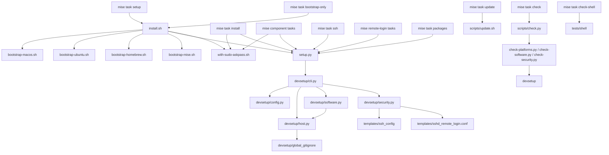

# Current code fact sheet

> Line counts were not available from the read-only tool interface. The repository context supplied approximate counts for several files, but those are not substituted for exact per-file counts here. Every entry point below has a `path:line` citation. External-command lists capture commands visibly invoked by the source, not all transitive commands run by third-party installers.

## 1. Per-file facts

### Shell entry points and bootstrap

| File | Purpose | Public functions / entry points | Repo imports or invokes | External executables |
|---|---|---|---|---|
| `install.sh` | Validates profile, user, OS and architecture; handles SSH/dotfiles consent; sources bootstrap phases; runs Python bootstrap and aggregate install. | Script entry point; `usage()` (`install.sh:17`). | Sources `scripts/bootstrap-$platform.sh`, `scripts/bootstrap-homebrew.sh`, `scripts/bootstrap-mise.sh`; invokes `scripts/setup.py`; then `scripts/with-sudo-askpass.sh` (`install.sh:148-169`). | `uname`, `sudo` is rejected as execution mode through `$EUID` but not invoked; `xcode-select` via sourced helper; `apt-get` via sourced helper; `curl`, `/bin/bash`, Homebrew `brew`, `mise`, `sha256sum`/`shasum`, `cut`, `mktemp`, `mkdir`, `chmod`, `mv`, `readlink`, `ln`, `python`. |
| `scripts/bootstrap-macos.sh` | Waits for Apple Command Line Tools, installing them when absent. | Sourced helper, not an independent entry point (`scripts/bootstrap-macos.sh:2-5`). | Sourced only by `install.sh:150`. | `xcode-select`, `sleep`. |
| `scripts/bootstrap-ubuntu.sh` | Installs Ubuntu build and setup prerequisites. | Sourced helper (`scripts/bootstrap-ubuntu.sh:2-4`). | Sourced only by `install.sh:150`. | `sudo`, `apt-get`. |
| `scripts/bootstrap-homebrew.sh` | Installs Homebrew at platform prefix when missing and runs initial update. | Sourced helper (`scripts/bootstrap-homebrew.sh:2-6`). | Sourced only by `install.sh:151`; prefix agrees with `defaults.toml:43-44,132`. | `curl`, `/bin/bash`, `brew`, `mktemp`, `rm`. |
| `scripts/bootstrap-mise.sh` | Fetches checksum-pinned mise, links the bootstrap-managed executable and installs the locked Python. | Sourced helper; `sha256_of()` (`scripts/bootstrap-mise.sh:21`). | Sourced only by `install.sh:152`; reads `mise.toml` and `mise.lock` through mise (`scripts/bootstrap-mise.sh:57-59`). | `sha256sum` or `shasum`, `cut`, `mkdir`, `mktemp`, `curl`, `chmod`, `mv`, `readlink`, `ln`, `mise`. |
| `scripts/with-sudo-askpass.sh` | Acquires sudo once, keeps authorisation alive, runs a command and cleans temporary password material. | Script entry point; `cleanup()` (`scripts/with-sudo-askpass.sh:19`). | Invoked by installer and task commands (`install.sh:168-169`, `mise.toml:31,41,46,51,56,61,66,71,76,81`). | `sudo`, `mktemp`, `chmod`, `printf`, `cat` (generated helper), `kill`, `wait`, `rm`, `sleep`. |
| `scripts/update.sh` | Updates all detected managed software classes, records per-component outcomes and returns failure if any component failed. | Script entry point; `run()` and `skip()` (`scripts/update.sh:12,24`). | Invoked by `mise.toml:84-87`. | `brew`, `mise`, `npm`, `pnpm`, `mas`, `ollama`, `uname`, `command`, `tail`. |
| `scripts/setup.py` | Checks Python version, adds `scripts` to import path, calls CLI main. | Script entry point (`scripts/setup.py:6-13`). | Imports `devsetup.cli` (`scripts/setup.py:10-13`). | Python interpreter. |

### Python implementation

| File | Purpose | Public functions / entry points | Imports or invokes other repo files | External executables |
|---|---|---|---|---|
| `scripts/devsetup/__init__.py` | Package-level description only. | None. | None. | None. |
| `scripts/devsetup/config.py` | Selects supported platform/profile, merges settings and flags, expands paths and validates required values. | `detect_platform()` (`config.py:45`), `load()` (`config.py:190`); `ConfigError` (`config.py:41`). | Reads `defaults.toml` and optional user TOML (`config.py:208-214`). | No shell-outs. Uses Python `pwd`, `os.uname`, filesystem and TOML libraries. |
| `scripts/devsetup/cli.py` | Defines action parser, loads config, sets Homebrew-prefix PATH, dispatches actions and controls aggregate ordering. | `dispatch()` (`cli.py:51`), `parse_args()` (`cli.py:160`), `main()` (`cli.py:185`). | Imports config; dynamically imports `devsetup.host`, `devsetup.software`, `devsetup.security` (`cli.py:15,44-48,59-60`). | No direct subprocess calls. |
| `scripts/devsetup/software.py` | Merges layered Brewfiles and mise tools; previews or installs them; manages the mise conf.d fragment and Node globals. | `run()` (`software.py:39`), `layer_files()` (`software.py:98`), `brewfile()` (`software.py:106`), `tools()` (`software.py:115`), `fragment_path()` (`software.py:159`), `record_tools()` (`software.py:199`). | Imports `ensure_block` from `devsetup.host` (`software.py:25`); reads `packages/**`; writes user mise `conf.d/dev-machine-setup.toml`. | `brew bundle install`, `brew list`, `brew uninstall`, `mise install`, `mise exec`, `pnpm`; `mdimport /Applications` for App Store package install (`software.py:226-239,282-340`). |
| `scripts/devsetup/host.py` | Manages ordinary host configuration, shell setup, Git, Zsh, fzf, macOS preferences, Dock and external dotfiles. | `run()` (`host.py:35`), `ensure_block()` (`host.py:126`), action functions `preflight()`, `bootstrap()`, `git()`, `_checkout()`, `zsh()`, `fzf()`, `osx()`, `dock()`, `dotfiles()` (`host.py:161,177,198,241,299,331,342,356,375`). | Reads `scripts/devsetup/global_gitignore`; invokes external dotfiles `~/.dotfiles/install.sh` (`host.py:22,394`). | `brew`, `git`, `sudo` (and `chsh`), `sh`, `fzf`'s `install`, `chflags`, `defaults`, `killall`, `dockutil`; `curl`/HTTP via Python urllib. |
| `scripts/devsetup/security.py` | Handles SSH client configuration and Remote Login preflight, deployment, rollback, access controls, activation and revocation. | Sole public entry `run()` (`security.py:50`); internal `_System` (`security.py:463`). | Reads `templates/ssh_config` and `templates/sshd_remote_login.conf` (`security.py:29,127` and subsequent render call sites). | SSH client path: no external command for file-copy/config operations. Remote Login only: configured `tailscale` CLI; `ssh-keygen`; `sudo`; configured `launchctl`; `sshd`; `/usr/bin/install`, `/bin/cat`, `/bin/rm`; `dscl`, `dseditgroup`; socket probe implemented in Python. `sshd -t/-T` gates config. |

### Check programs

| File | Purpose | Public functions / entry points | Imports or invokes other repo files | External executables |
|---|---|---|---|---|
| `scripts/check.py` | Orchestrates non-installing repository checks. | `main()` (`check.py:12`), script guard (`check.py:54`). | Calls `check-platforms.py`, `check-software.py`, `check-security.py`; runs Bats under `tests/shell` (`check.py:29-35`). | `bats`, `/bin/bash -n`, Python. Parses TOML. |
| `scripts/check-platforms.py` | Exercises config/platform selection, CLI ordering, installer prompts and host operations using temporary homes and substitute commands. | Top-level executable; helpers `expect_error()`, `command()`, `environment()` (`check-platforms.py:27,36,44`). | Imports `devsetup.cli`, `devsetup.config`, `devsetup.host`; copies/runs `install.sh`, `new-mac.sh`, `remote-login.sh` in fixtures (for example `check-platforms.py:19-22,242-265,552-555`). | Python, Bash, Git, fake Homebrew/mise/sudo and related fixture commands; some host checks use real Git in temporary directories. |
| `scripts/check-software.py` | Exercises inventory layering, previews, bundle calls, tool installation and mise-fragment writes with fake tools. | Top-level executable; helpers `write()`, `fake()`, `fixture_repo()`, `snapshot()`, `fails()`, `bundle_call()`, `ordered()` (`check-software.py:55-135`); `Machine` fixture (`:77`). | Imports `devsetup.software` and `devsetup.config.STEPS` (`check-software.py:16-19`); synthesises package inventory fixtures. | Python and fake `brew`, `mise`, `mdimport`; fixture fake uses `sed` and `tr` (`check-software.py:21-36`). |
| `scripts/check-security.py` | Exercises security state transitions with stateful fake commands; on macOS additionally asks system sshd to parse temporary configurations. | Top-level executable; embedded `RUNNER` and fake scripts (`check-security.py:28-37,39-238`); scenario code runs at module top level. | Imports `devsetup.security` inside child runner; uses `templates` indirectly through security (`check-security.py:28-36`). | Fake `launchctl`, `sudo`, `tailscale`, `ssh-keygen`, `sshd`, `dscl`, `dseditgroup`; real `/usr/bin/ssh-keygen` generates temporary test keys; real `/usr/sbin/sshd` optionally validates fixtures (`check-security.py:77-80,690-744`). |

### Data files

| File | Purpose and dependency | Executables / entry points |
|---|---|---|
| `mise.toml` | Mise settings, Python tool pin and task registry (`mise.toml:1-117`). | Task list in section 3. |
| `defaults.toml` | Shared and platform-specific settings; step policy and macOS argument lists (`defaults.toml:5-132`). | No executables. |
| `templates/ssh_config` | Renders shared IdentityAgent and two GitHub identity-file entries (`templates/ssh_config:1-15`). | Consumed by security SSH client action. |
| `templates/sshd_remote_login.conf` | Renders restrictive sshd Match-all block with per-user allow list and command PATH (`templates/sshd_remote_login.conf:1-19`). | Consumed by Remote Login action. |
| `scripts/devsetup/global_gitignore` | Managed global Git ignore contents, copied by host Git action (`host.py:22,204-211`). | Data file; no executable. |

## 2. Dependency graph

`mise.toml` also has direct component tasks for `cli`, `gui`, `app-store`, `osx`, `dock`, `dotfiles`, `git`, `zsh`, and `node`; each runs `with-sudo-askpass.sh python scripts/setup.py <action> --mise "{{ mise_bin }}"` (`mise.toml:39-82`). The `ssh` and Remote Login tasks intentionally bypass that wrapper (`mise.toml:89-106`).

## 3. Mise task command list

| Task | Command |
|---|---|
| `setup` | `./install.sh` (`mise.toml:19-22`) |
| `bootstrap-only` | `./install.sh --bootstrap-only` (`mise.toml:24-27`) |
| `install` | `scripts/with-sudo-askpass.sh python scripts/setup.py install --mise "{{ mise_bin }}"` (`mise.toml:29-32`) |
| `packages` | `python scripts/setup.py packages --mise "{{ mise_bin }}"` (`mise.toml:34-37`) |
| `cli` | `scripts/with-sudo-askpass.sh python scripts/setup.py cli --mise "{{ mise_bin }}"` (`mise.toml:39-42`) |
| `gui` | `scripts/with-sudo-askpass.sh python scripts/setup.py gui --mise "{{ mise_bin }}"` (`mise.toml:44-47`) |
| `app-store` | `scripts/with-sudo-askpass.sh python scripts/setup.py app-store --mise "{{ mise_bin }}"` (`mise.toml:49-52`) |
| `osx` | `scripts/with-sudo-askpass.sh python scripts/setup.py osx --mise "{{ mise_bin }}"` (`mise.toml:54-57`) |
| `dock` | `scripts/with-sudo-askpass.sh python scripts/setup.py dock --mise "{{ mise_bin }}"` (`mise.toml:59-62`) |
| `dotfiles` | `scripts/with-sudo-askpass.sh python scripts/setup.py dotfiles --mise "{{ mise_bin }}"` (`mise.toml:64-67`) |
| `git` | `scripts/with-sudo-askpass.sh python scripts/setup.py git --mise "{{ mise_bin }}"` (`mise.toml:69-72`) |
| `zsh` | `scripts/with-sudo-askpass.sh python scripts/setup.py zsh --mise "{{ mise_bin }}"` (`mise.toml:74-77`) |
| `node` | `scripts/with-sudo-askpass.sh python scripts/setup.py node --mise "{{ mise_bin }}"` (`mise.toml:79-82`) |
| `update` | `MISE_BIN="{{ mise_bin }}" scripts/update.sh` (`mise.toml:84-87`) |
| `ssh` | `python scripts/setup.py ssh --mise "{{ mise_bin }}"` (`mise.toml:89-92`) |
| `remote-login-check` | `python scripts/setup.py remote-login-check --mise "{{ mise_bin }}"` (`mise.toml:94-97`) |
| `remote-login` | `python scripts/setup.py remote-login --mise "{{ mise_bin }}"` (`mise.toml:99-102`) |
| `remote-login-revoke` | `python scripts/setup.py remote-login-revoke --mise "{{ mise_bin }}"` (`mise.toml:104-107`) |
| `check` | `python -B scripts/check.py` (`mise.toml:109-112`) |
| `check-shell` | `bats tests/shell` (`mise.toml:114-117`) |

## 4. Full steps policy and defaults key types

Canonical `[steps]` list (`defaults.toml:26-37`): `ssh=false`, `git=true`, `cli=true`, `remote-login=false`, `gui=true`, `zsh=true`, `app-store=true`, `osx=true`, `node=true`, `dotfiles=true`, `dock=true`.

All root keys and TOML types (`defaults.toml:5-132`):

| Key | Type |
|---|---|
| `git_email` | string |
| `git_name` | string |
| `dotfiles_repo` | string |
| `dotfiles_version` | string |
| `dotfiles_conflict_paths` | array of strings |
| `personal_public_ssh_key` | string |
| `work_public_ssh_key` | string |
| `remote_login_public_keys` | array of strings |
| `remote_login_sources` | array of strings |
| `pnpm_global_packages` | array of strings |
| `revoke_remote_login` | boolean |
| `steps` | table; each listed value boolean |
| `mac` | table |
| `mac.shell_path` | string |
| `mac.ssh_agent_socket` | string |
| `mac.pnpm_home` | string |
| `mac.brew_prefix` | string |
| `mac.remote_login_sshd_file` | string |
| `mac.tailscale_cli` | string |
| `mac.macos_preferences` | array of arrays of strings (argument vectors) |
| `mac.dock_items` | array of arrays of strings (argument vectors) |
| `linux` | table |
| `linux.shell_path` | string |
| `linux.ssh_agent_socket` | string |
| `linux.pnpm_home` | string |
| `linux.brew_prefix` | string |

The two argument-list fields are validated as non-empty rows of strings on macOS (`config.py:166-181`). `brew` is a derived config value, defaulting to `<brew_prefix>/bin/brew`, not declared in `defaults.toml` (`config.py:231-234`). Private security command seams are rejected in config files: see `config.py:32-38,92-96`.

## 5. Executables exclusive to Remote Login/security

Compared with bootstrap, host, software and update paths, these command executables are exclusive to the Remote Login operations in `security.py`: `launchctl`, `sshd`, `dscl`, `dseditgroup`, and `ssh-keygen` (for Remote Login key validation/fingerprints and host-key handling). `tailscale` is checked/invoked by the security preflight and enable path; it is configured as an absolute CLI path at `defaults.toml:45` and called in `security.py:282-341`. `sudo` is **not** exclusive: the generic sudo wrapper and host actions also use it. `killall` is used by host Finder/Dock actions, not Remote Login. Low-level helpers `/usr/bin/install`, `/bin/cat`, `/bin/rm` are used only for privileged managed server configuration deployment/rollback (`security.py:528-587`). `mdimport` is a software/App Store path, not Remote Login.

## 6. Unused, duplicated, and test-only observations

- `scripts/devsetup/__init__.py` contributes only a module docstring; no functions or runtime logic.
- `scripts/devsetup/global_gitignore` is a data file read by host Git setup, not dead weight (`host.py:22,204-211`).
- Both check scripts and Bats tests are test/check harnesses rather than provisioning paths: `scripts/check.py:29-35`, `AGENTS.md:32-34`. `check-platforms.py` and `check-software.py` use temporary fixtures and stand-in executables; `check-security.py` creates stateful command fakes (`check-security.py:3-9,39-238`).
- `scripts/devsetup/config.py:32-38` identifies `TEST_ONLY_KEYS` used as command injection seams in isolated tests. These include `remote_login_sudo`, `remote_login_ssh_keygen`, `remote_login_dscl`, `remote_login_dseditgroup`, `remote_login_host_key`, `remote_login_port`, `remote_login_port_timeout`, `remote_login_config_owner`, and `remote_login_config_group`; config loading rejects them in settings files (`config.py:92-96`).
- `remote_login_sshd` and `remote_login_launchctl` are intentionally retained, documented overrides for isolated validation rather than generally enabled local config (`AGENTS.md:58-60`; `config.py:153-161`; `security.py:468-473`).
- `security.py` imports `json` and other helpers for Tailscale JSON/state parsing, and `itertools` for unique backups; not apparently unused from the inspected sections. The main check suite statically parses every TOML and bash-checks shell files (`check.py:21-40`).
- Mise tool ownership and Homebrew package inventory are deliberately split. `packages/**/tools.*.toml` stores mise declarations; `Brewfile.*` stores Brew Bundle declarations. `software.py` supplies layering, override and action/failure behavior over those inventories (`software.py:98-128,247-340`).
- No source file in the requested set is established as wholly unused by the available evidence. The bootstrap helpers are sourced by `install.sh`; `setup.py` is used by mise tasks and installer; templates and global ignore are read by their relevant module.

## Mise bootstrap coverage and current repository relationship

Current mise documentation describes bootstrap resources for packages, files/directories, services, repos, dotfiles, shell activation, macOS defaults, LaunchAgents, Linux systemd units, user settings, and tools. It provides phase status, `--dry-run`, a structured plan for a subset of resource types, and states that bootstrap is sequential rather than transactional; hooks and the final task rerun on every selected apply ([mise Bootstrap](https://mise.jdx.dev/bootstrap.html)). Package managers include apt, brew, brew-cask, macos-app and mas, among others ([mise Bootstrap Packages](https://mise.jdx.dev/bootstrap/packages/)).

- **`software.py`:** Package declarations and basic installs have substantial documented overlap with mise bootstrap packages and `[tools]`. However, current code additionally combines profile/layer selection, Brewfile concatenation, `brew bundle` semantics, managed global mise-fragment updates, package conflict removals, Node/pnpm global installation, per-step optional failures, and update behavior (`scripts/devsetup/software.py:98-128,199-239,247-340`; `scripts/update.sh:12-74`). Bootstrap could host equivalents using declarative package/tools resources and tasks, but its documented surface does not make those repository-specific policies disappear. The existing package owner is also Homebrew Bundle according to `AGENTS.md:164-205`.
- **`host.py`:** Mise bootstrap documents files/directories, dotfiles, shell activation, macOS defaults, packages and current-user login shell. Those overlap with some host actions. It does not provide a direct declarative replacement for this module's full Git identity/ignore policy, Zsh plugin checkout behavior, fzf setup, guarded external dotfiles installer semantics, or current ordered host preflight (`scripts/devsetup/host.py:161-395`). Mise tasks could execute imperative work, but that would still be custom code, not replacement by the bootstrap resource model. Therefore bootstrap does not directly replace all of `host.py`.
- **`with-sudo-askpass.sh`:** Mise bootstrap can perform some privileged package/resource operations and documents a `system_packages.sudo` setting; dry-run is a preview and `--yes` only bypasses mise's confirmation, not sudo credentials ([Bootstrap Packages](https://mise.jdx.dev/bootstrap/packages/)). The docs do not establish an equivalent to this wrapper's specific behavior: NOPASSWD verification fallback, one terminal password prompt, temporary askpass secret handling, a kept-alive sudo credential during arbitrary child operations, exit propagation and cleanup (`scripts/with-sudo-askpass.sh:11-65`; `AGENTS.md:159-163`). Thus the documented bootstrap is not a drop-in replacement for the wrapper.
- **Preview:** `mise bootstrap --dry-run` previews selected declarative phases, but explicitly does not execute hooks or final task. The structured planner covers a subset and reports unknown states (`https://mise.jdx.dev/bootstrap.html`). That preview contract differs from repository `--check`, whose implementation only previews selected actions and reports others as not previewed (`scripts/devsetup/cli.py:3-5`; `host.py:35-55`; `software.py:39-42`).
- **Services and security:** Bootstrap has generic service resources, but the repository's Remote Login implementation stops and unloads sshd before snapshot/deployment, validates both syntax and effective settings, checks account-blocking rules, rolls back file bytes and metadata on gate failure, narrows the directory-service access list, then enables service with failure shutdown and port validation (`scripts/devsetup/security.py:463-587,589-623,648-711`). The documentation alone does not provide these app-specific SSH safety invariants. Its existence does not show that mise has equivalent Remote Login gates.

**Evidence boundary:** Documentation claims above describe the current published mise docs accessed at the cited URLs. Whether particular mise releases or package providers behave identically on every target machine is not independently exercised here. No migration or installation was run.

### External source URLs

- https://mise.jdx.dev/bootstrap.html
- https://mise.jdx.dev/bootstrap/packages/

### Notes on line counts

This read interface did not provide a line-count command. It did expose source line numbers and reported total source lengths for some files while paginating them: `install.sh` 170 lines, `scripts/update.sh` 74, `scripts/setup.py` 15, `scripts/devsetup/config.py` 252, `scripts/devsetup/cli.py` 207, `scripts/devsetup/host.py` 395, `scripts/devsetup/security.py` 715, `scripts/check.py` 55, `scripts/check-platforms.py` 560, `scripts/check-software.py` 319, and `scripts/check-security.py` 744. These values are read-tool output totals for those files. Exact line totals for `bootstrap-*`, `with-sudo-askpass.sh`, `software.py`, `mise.toml`, `defaults.toml`, templates, package files and `__init__.py` remain unavailable in this interface.
